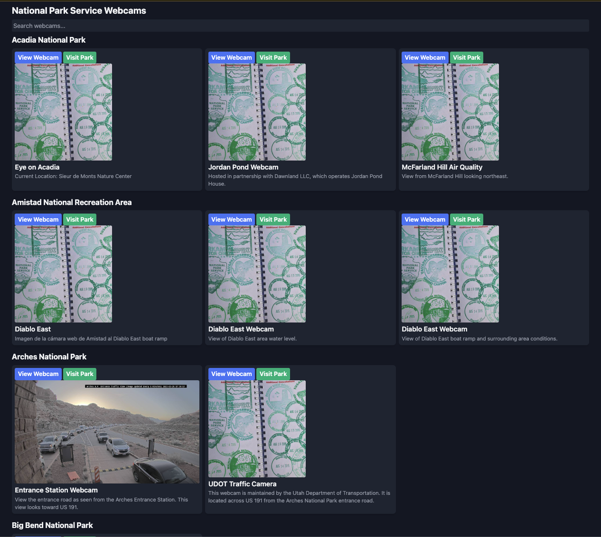
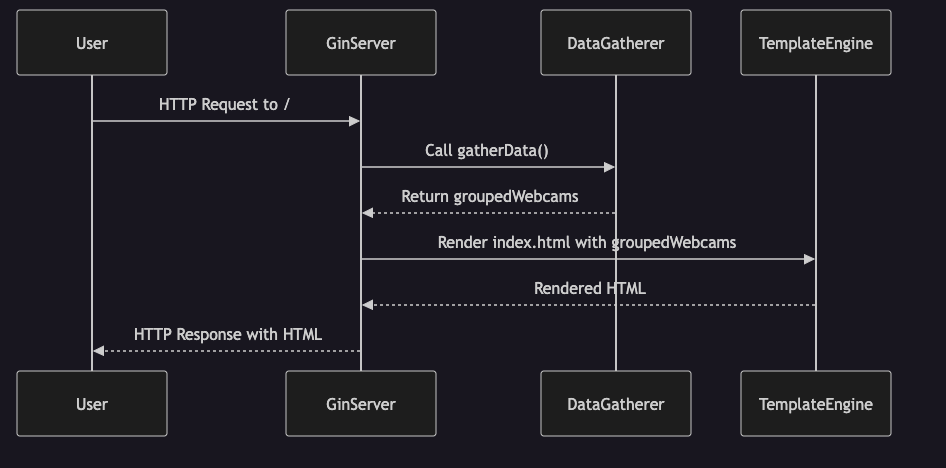

# National Park Service Webcam Gallery

This is a simple Go/Gin web app to display a gallery of the various National
Park Service webcams as discovered through the NPS API. This is a recreational
programming project that I thought would be useful and fun to explore.

I've hosted the application publicly using Railway:

<https://npswebcams-production.up.railway.app/>

[](https://railway.app/)

## Running locally

An API key can be obtained from the [NPS Developer Resources "Get Started"
page](https://www.nps.gov/subjects/developer/get-started.htm).

## To run

```bash
export NPS_API_KEY=<your key>
go run .
```

Then visit <http://localhost:8080/> in your browser.

## Screenshot



## Diagram

The dataset is very small and currently stored in memory. The NPS API is used on
app startup and then every 30 minutes to dynamically refresh the data.



## License

MIT
